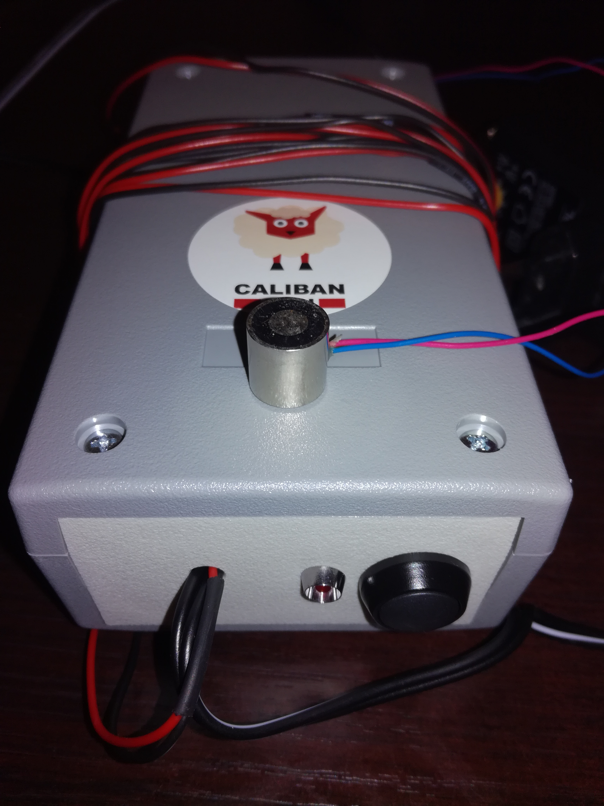

# Description du projet
Le boitier microPOC est un simple boitier minuteur déclenchant une charge au boût d'un certain temps. Il est notamment adapté à du spectacle de rue (pas de régisseur). Ce boitier simple peut être adapté et personnalisé comme on souhaite. Ici, la charge est un electroaimant permanent. C'est un electroaimant qui adhère tout le temps, même sans alimentation mais qui se désaimante quand on fait passer un courant.

# Mode d'emploi
- Branchez le boitier sur le secteur, la LED doit s'allumer.
- Collez un objet en acier sur l'electroaimant. (s'il était déjà collé, il le restera).
- Si vous appuyez une fois sur le bouton, l'objet tombera au bout de 10 secondes (LED clignote).
- Si vous appuyez deux fois sur le bouton, l'objet tombera au bout de 20 secondes (LED clignote).
- Et ainsi de suite
- Si vous appuyez sur le bouton pendant plus d'une seconde, le compte à rebour s'arrête (LED clignote plus).

# charge acceptée
- Pour se désaimanter, une impulsion de 1s est envoyée. Pour information, un tel électroaimant ne doit pas être alimenté plus de 20 secondes sous peine de cramer. La charge doit être alimentée en 12V pour 0.6A maximum, sauf si on change l'alimentation 12V.

# liste de matériel
- Un boitier ABS G416 : https://www.gotronic.fr/art-boitier-abs-g416-6614.htm
- Un bouton poussoir : https://www.gotronic.fr/art-bp-noir-etanche-gq2n-19987.htm
- Un LED pour panneau : https://www.gotronic.fr/art-voyant-rouge-eco-l3vr-24583.htm
- Un électroaimant permanent : https://www.gotronic.fr/art-electroaimant-permanent-12-vcc-pe1212-12-23211.htm
- Un assortiment de fil souple : https://www.gotronic.fr/art-assortiment-fcs60-5211.htm
- Deux borniers deux points au pas 2.54 : https://www.gotronic.fr/art-bornier-sc02-2-54-15468.htm
- Une plaque de prototypage à souder : https://www.gotronic.fr/art-plaque-d-essais-double-face-pth30-21532.htm
- 1 transistor IRF520 : https://www.gotronic.fr/art-transistor-irf520n-1489.htm
- 1 diode 1N4007 : https://www.gotronic.fr/art-1n4007-107.htm
- 1 résistance 220 Ohms : https://www.gotronic.fr/art-10-resistances-1-4w-220-8486-2568.htm
- 1 Arduino Nano : https://www.gotronic.fr/art-module-arduino-nano-12422.htm
- 1 Alimentation secteur universelle : https://www.fnac.com/mp40503490/Alimentation-universelle-pour-disque-dur-externe-12V-3A/w-4#omnsearchpos=1

# schémas
